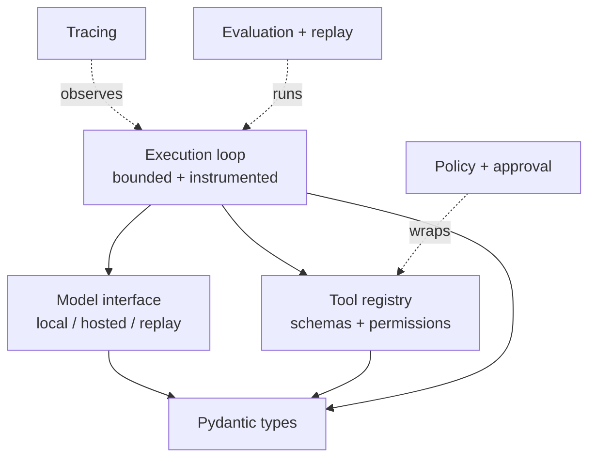
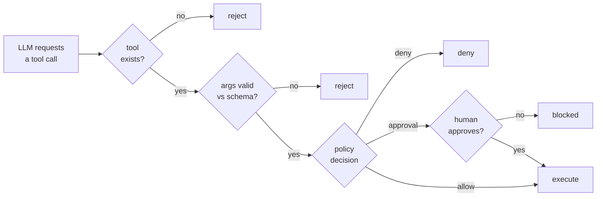

# Agent Reliability Harness

A reusable Python library for running LLM agents reliably. Agents are non-deterministic and occasionally do the wrong thing. This harness is the deterministic scaffolding around an agent that validates what it does, contains what it's allowed to do, observes everything it did, and recovers when things break.

The idea I kept coming back to while building it: reliability is a property of the harness, not the model. You can't make an LLM reliable, so you wrap it in a layer that makes the whole system reliable despite an unreliable core.

Built without LangChain or any orchestration framework, so the loop, validation, policy, tracing, and evaluation are all mine and all inspectable.

## What it does

You give the harness a model and a set of tools. It runs the agent loop for you, and every tool call passes through a gate that:

- validates the arguments against a schema before anything runs
- checks the tool's permission level and pauses for human approval on risky actions
- records the step to a persistent trace (tokens, latency, tool, result)
- retries with backoff if the model call fails, and gives up cleanly if it can't recover
- stops if the run exceeds its step limit or timeout

The agent itself contains none of that logic. It declares its tools and their permissions, and gains all of the above by running through the harness.

## Architecture

The harness is built in layers. The loop sits in the middle and depends only on interfaces, so models, tools, and policies are swappable and testable in isolation.



Every tool call goes through one gate before it runs:



## Components

- **Model interface** (`harness/models/`) — an abstract contract every model implements. `LocalModel` (Ollama), plus `ReplayModel` and fakes for testing. The loop depends on the interface, not any concrete model, which is what makes replay and testing possible.
- **Tool registry** (`harness/tools/`) — tools register with a Pydantic schema and a permission level. The same schema is shown to the model and used to validate its arguments, so the two can't drift apart.
- **Policy and approval** (`harness/policy/`) — decides allow / require-approval / deny from the tool's permission. Approval is an interface, so a CLI prompt in real use and an auto-approver in tests.
- **Execution loop** (`harness/core/`) — the bounded, instrumented loop. Step limit, timeout, retry with backoff, and a trace of every step.
- **Tracing** (`harness/tracing/`) — every run saved as structured JSON: steps, tokens, latency, status.
- **Evaluation and replay** (`harness/eval/`) — score an agent against a test suite, and replay a saved trace deterministically for debugging and regression tests.
- **Dashboard** (`harness/dashboard/`) — a CLI that aggregates all traces into a summary: success rate, latency, failure breakdown.

## The capstone: hardening a real agent

`examples/file_agent.py` is a file-operations agent (read, write, delete) run through the harness. It's the proof that the harness hardens a real agent. The agent declares three tools at three permission levels:

- `read_file` is READ, so it runs automatically
- `write_file` is WRITE, so it pauses for approval
- `delete_file` is DANGEROUS, so it always needs an explicit yes

Run it and the harness gates every risky call, rejects malformed ones before they touch the filesystem, and blocks a delete the moment you decline. None of that safety lives in the agent. It comes entirely from running through the harness. That's the whole point in one demo.

## Running it

```bash
python3 -m venv venv
source venv/bin/activate
pip install -e .

# run the test suite (every component is tested)
pytest -v

# run the capstone demo
python examples/file_agent.py

# aggregate all run traces into a summary
python -m harness.dashboard.cli
```

With Docker:

```bash
docker compose build
docker compose run --rm harness   # runs the tests inside the container
```

The harness talks to Ollama on the host via `host.docker.internal`, set through the `OLLAMA_HOST` env var so the same code runs natively and in a container.

## What I'd do differently at scale

- **Interrupt hung calls, not just slow ones.** The timeout checks between and after model calls, so it catches a slow call but not one that hangs forever. Real interruption needs threads with cancellation or async timeouts.
- **Distinguish error types in retry logic.** Right now it retries any failed model call. A permanent failure like a bad API key shouldn't be retried at all. I'd inspect the error and only retry transient ones, and add jitter to the backoff to avoid synchronized retries.
- **Tool retrieval for large tool sets.** Every tool's schema goes to the model each call. Fine for a handful, wasteful at hundreds. I'd embed tool descriptions and retrieve the relevant few.
- **Redact sensitive data in traces.** Traces are written in plain JSON and could contain sensitive tool arguments. Production needs redaction, configurable verbosity, and access control.
- **A model-service container instead of host-Ollama.** Reaching the host's Ollama is a development convenience. A cleaner deploy runs the model as its own service, or uses a hosted API.

## Notes

- Local-first on Ollama, so it's free to develop and swappable to a hosted model through the same interface.
- Pydantic everywhere for validation, because catching bad data at the boundary is the harness's whole job.
- Secrets and run traces are gitignored.
